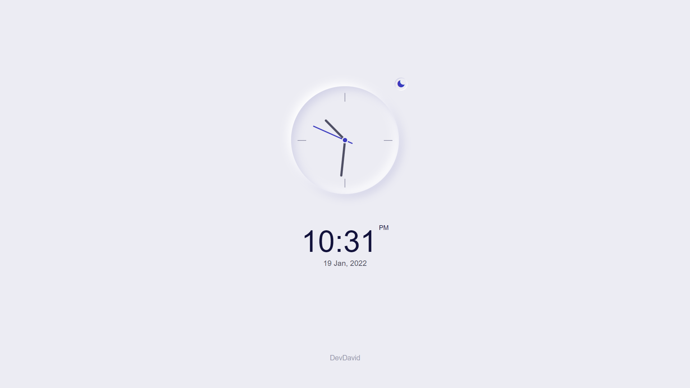

 
  

🎯 Sobre
    
   
O site foi realizado na proposta de criar um projeto simples e interativo. O objetivo foi criar um relógio analógico, adicionando novas funcionalidades e a criatividade.

🚀 Tecnologias
    

A seguintes ferramentas e tecnologias foram utilizadas nesse projeto:

JavaScript

HTML5

CSS3
 

Feito com ❤️ por David Richard